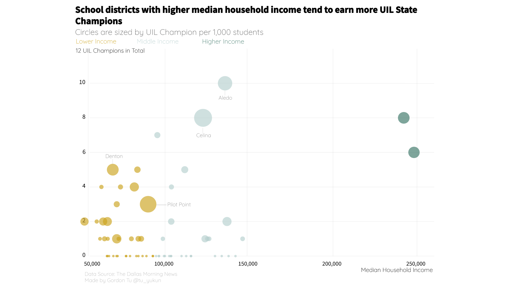

# Dallas Take-Home Tasks
## What is UIL champions?
UIL member schools can earn State Champions at different sports in their conference group(1A to 6A). Each year UIL gives out 793 State Champions(schools).
## Task1
*propose additional datasets that you would complement it with and what the visualization/story it would tell.*
### Proposed Datasets: 
1. Teacher salary after cost of living adjusted if possible
2. Data on gifted programs?
### Target Audiences
1. What do Dallas reader really want to know/would pay attention to when you tell them that we have some data about school in each school district?
2. Why would Dallas readers want to know anything about Dallas school districts?
3. Who are those readers?

**There are two groups of primary audiences for this dataset**
  * People who go to school in Dallas school districts: Families who have kids(not just atheletes)
  * Education staff working in Dallas school districts: teachers, school administrators


### Stories
* How does the number of UIL State Champions contribute to students' "futures"? Or What makes a UIL State Championship meaningful?
  * If it's about college, we should learn more about how UIL influences college application.
  * However, what if UIL does not matter so much, because there are programs like "Gifted Programs"?
* What are the school districts/school doing better/worse these years?
* What are the factors contributing to the school gaining more UIL champions?
* Can we rank them with some other metrics of a SD or a school?
  * Aledo school district seems to be very competitive even compare to the two upper class school districts.


## Task2


in Javascript 
```javascript
function function drawChart(){
const data = await d3.json("https://s3.amazonaws.com/interactives.dallasnews.com/jobtests/graphicsreporter/testdata.json")
}

```

In Svelte,
```javascript
  import { onMount } from "svelte"
  import * as d3 from "d3"

  let data =[]
  onMount(async() => {
    data = await d3.json("https://s3.amazonaws.com/interactives.dallasnews.com/jobtests/graphicsreporter/testdata.json")
  })
```

This data visualization only revealed on aspect of the given dataset: school districts with higher median household income are more likely to earn more UIL championships.

### How I would deploy the visualization:
Given the size of the dataset, I could load it remotely so that will not block the main thread. 

One thing I need to be careful with is that: I need to make sure the dataset api remains accessible.

## Task3
### Code
https://observablehq.com/d/4950cf14b79530ff#map_data

I merged the datasets from **Task2** into the *shapefile*.
I converted the *shapefile* into `.geojson` and then used **mapshaper** to convert `geojson` into topojson. D3 can use `TopoJSON` library to import and process such file.

It would also come handy when I am making a map about the spatial pattern of the given attributes like enrollments and school championship years, because those attributes are already to the same dataset.


## Task4
### Datasets

* As poor families selling their homes in competitive ZIP codes, **census data** of the studied area and neighboring areas (across serveral years if possible)
  * **Visualization** --
  District Map: Highlight areas where low-income residents have moved out and higher-income residents have moved in, since sometime. Also, is there any seasonality for such flow of population?

* One typical phenomena is along with gentrification, there often comes with a decline in population of racial and ethnic groups. **Voter demographics** of the political parties in the studied area and neighboring areas (across serveral years if possible)
  * **Visualization** --
  Would I be seening any changes when it comes to election happening in the area? A bar chart(or some variant of it) can be applied here on the purpose of comparison around the time period when I would assume the gentrification happened
  
* With gentrification, the real state markets will heat up and rent will rise. The history of racial exclusion, segregation and inequality in real estate has made homeownership Predatory landlords Housing data (on Zillow, Apartments.com and Craig's list)
  * **Visualization** --
  A heatmap of housing prices with race/income visually encoded as color should be helpful with presenting the spatial distribution of 

* Crime Data
  * **Visualization** --
  "Demographic change in cities could play a role in pressuring the police to pursue tactics that feel unduly aggressive to the people who preceded the newcomers." 
  I would adopt **dot map** at the beginning EDA process
https://www.nytimes.com/2017/01/05/upshot/how-to-predict-gentrification-look-for-falling-crime.html


